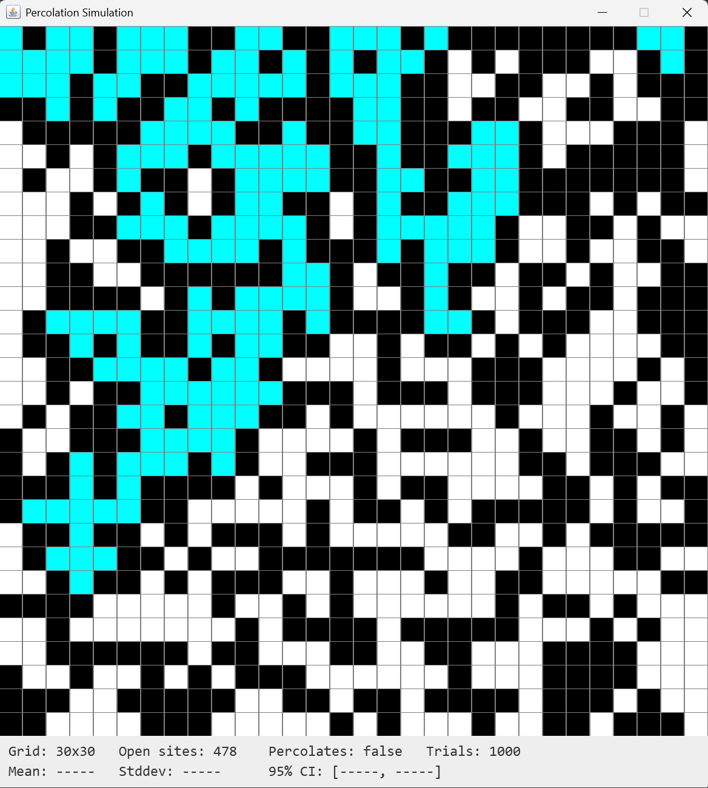
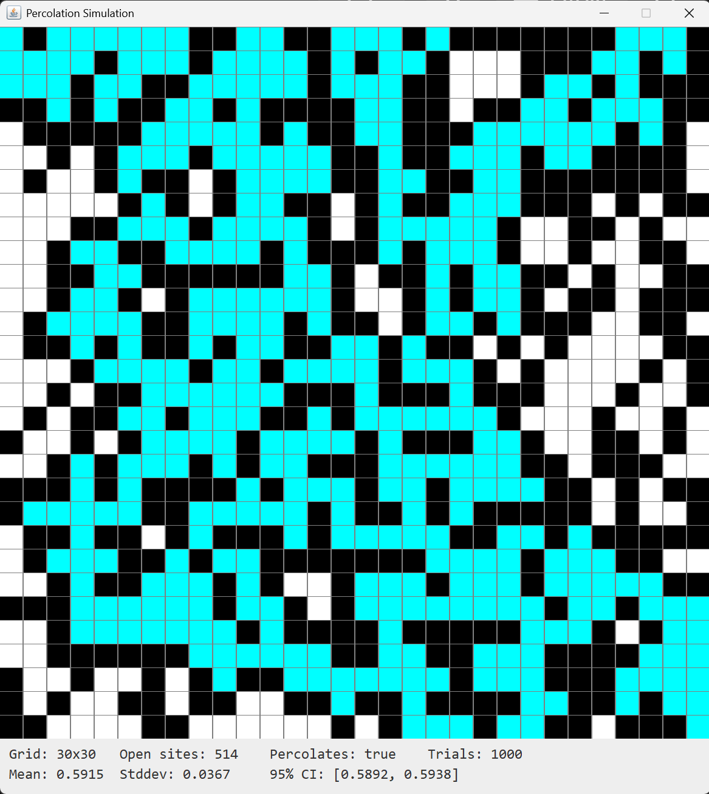
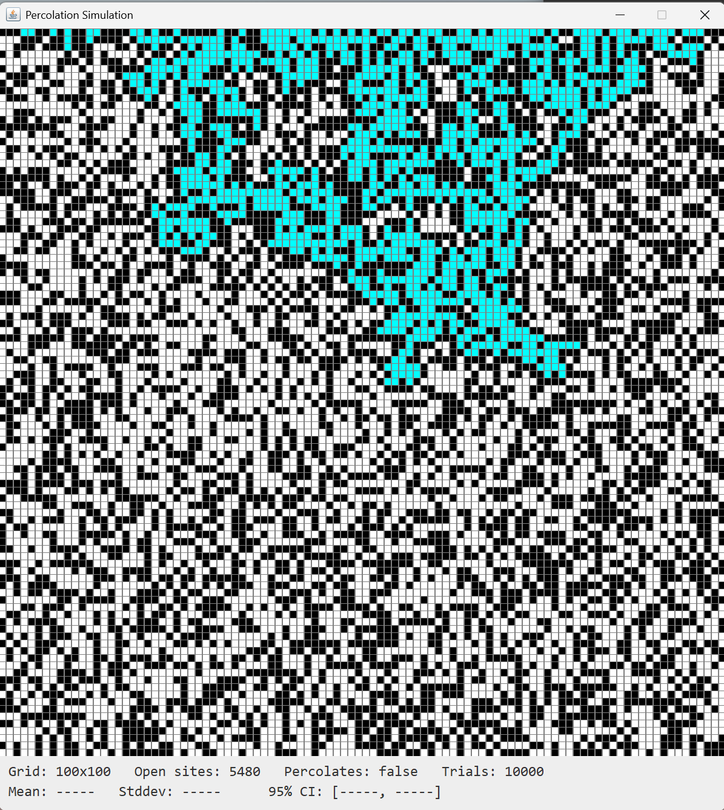
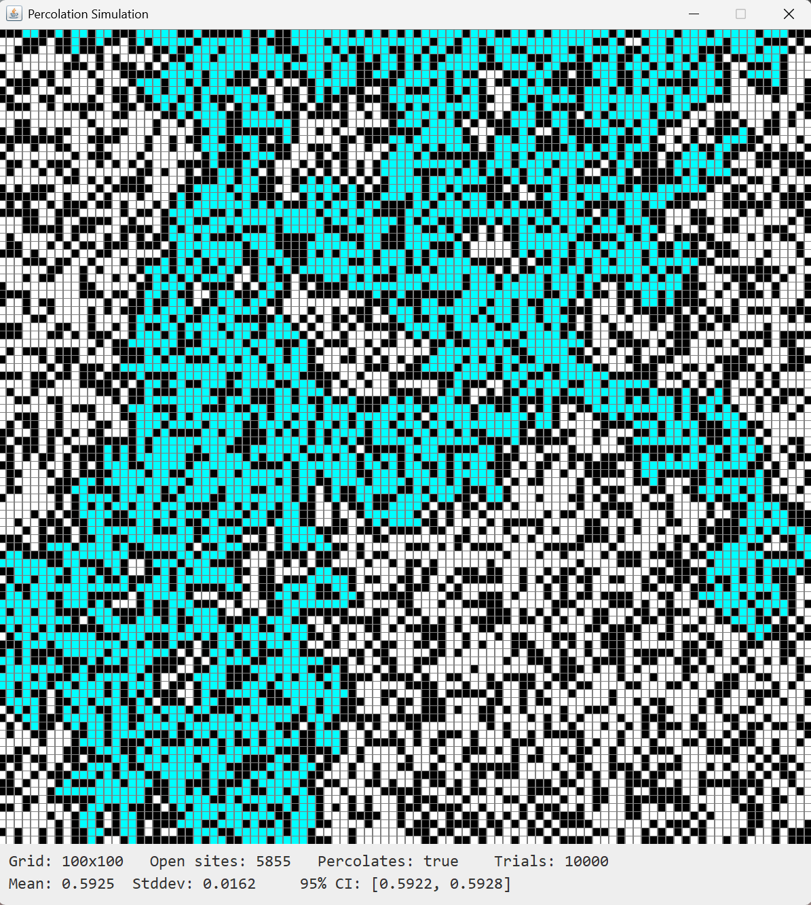

# Percolation Simulation 
### Connor Melton | Java | 2024

A Java implementation of a percolation system modeled using a Weighted Quick Union–Find data structure.

**Features**
- Custom union–find algorithm
- Monte Carlo simulation to estimate percolation threshold
- Clean CLI driver and modular class design

**Usage**
```bash
javac -d bin src\util\*.java src/*.java
java -cp bin PercolationVisualizer
```

**Demo**







